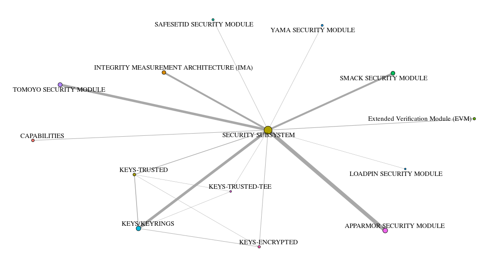
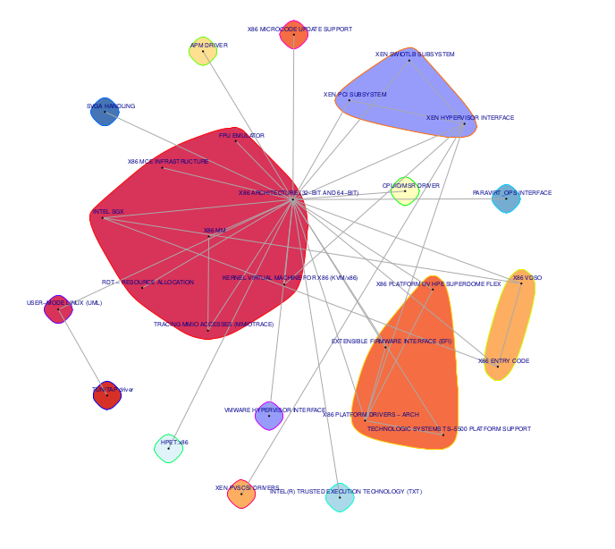
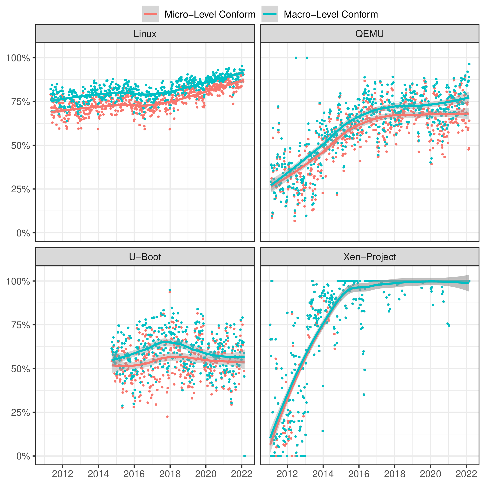

# Socio-Technical Distillation: From Micro-Level Responsibilities to Macro-Level Architecture Views

Welcome to our Supplementary Website

## Abstract

The development of large software systems requires thousands of individuals to collaborate. This necessitates a logical decomposition of the system into smaller, manageable pieces, augmented by clearly defined ways of appraising and admitting modifications to the code base. While software architectures and integration processes are established means, neither can be automatically inferred from fundamental technical artefacts, such as source code. Rather, they require a-priori human involvement, judgement, and abstraction. Yet commonly, maintaining the formal description of architectures and process specifications is not a primary concern.

We show that often, open-source projects already contain well-tended micro-level information on code responsibility, and therefore the required human knowledge. We automatically derive \macro views of software architectures, enriched with semantically understandable component identifiers without direct human involvement.

We show how to visually track the temporal evolution of the derived macro-level architectural views. We argue that our results form a basis for quantitatively judging quality properties of projects. We exemplify this by applying our methodology to a specific use case, where we assess component viability for safety-critical software and other semi-formal certifications.

Finally, we evaluate our methodology using a carefully crafted mixed-method approach, comprising statistical modelling and analysis, expert-based assessment of results, and targeted interviews with key developers.

## Reproduction Package

View the [reproduction package patch](/0001-repro-package.patch). The Patch(es)
will be disclosed in a non-anonymised fashion after peer review.

## Info: Mailing List Data

The data mailing lists data contains several GiB of data and will not be
uploaded to this website until the review process has finished. Data can be
provided on demand via the PC.

## Supplementary Material

### The Temporal Evolution of the Macro-View of the Linux Kernel

As this analysis contains macro-views for over 200 versions of the Linux
kernel. Please find the supplementary material [here](evolution_linux/index.md)

### Network View for the Security Partition

#### Example 1: The Security Subsystem

#### Example 2: The X86 Architecture Support

### Conformance Ratio of all subject projects

## Material for the Mixed-Method Approach

View the [maintainers survey email](Maintainers-Survey.md)

View the [GUI to verify the example cells](cluster_gui.tar.gz)
